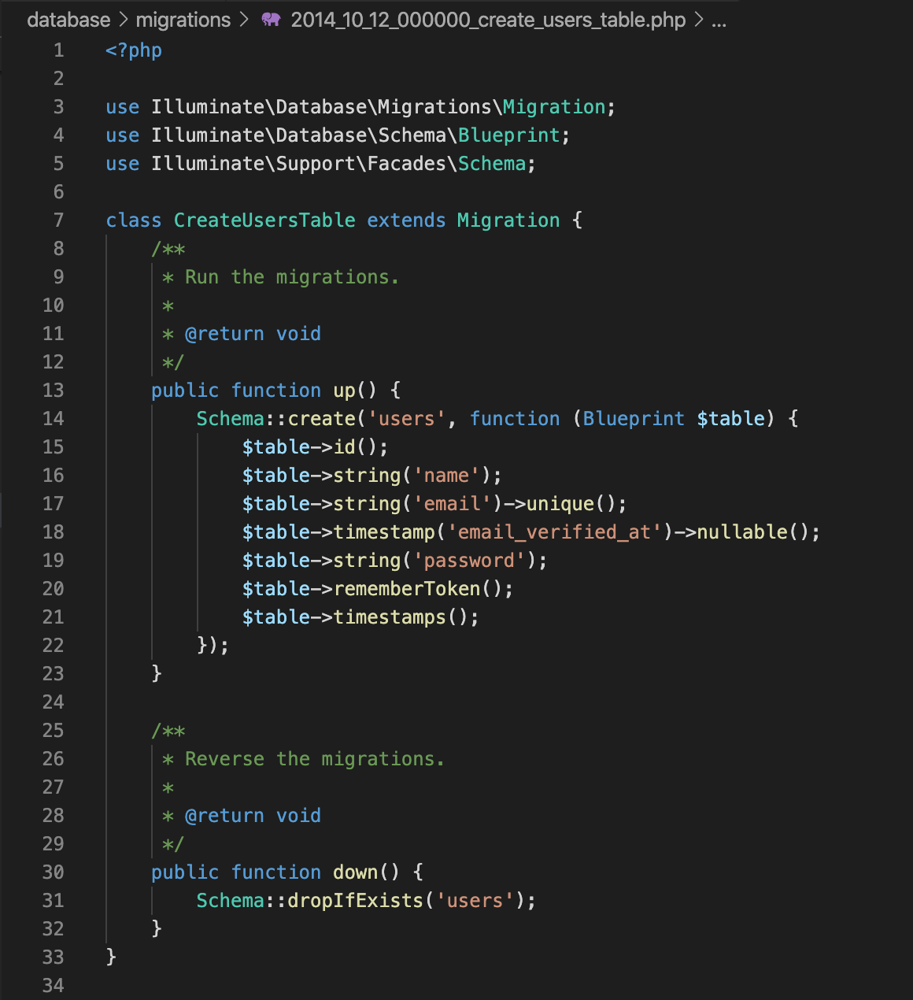

# TTMS-0900-Harkka

14.08.2020 
Oskari Saarinen N8243 
TTMS-0900 Web-palvelinohjelmointi - Harjoitustyö 

Toimiva sovellus löytyy täältä: https:// saario.xyz /gallery (Tulossa)

Kaikki lähdekoodit (myös automaattisesti luodut) zipattuna: https://saario.xyz/gallery/all.zip

Videoesittely: https://youtu.be/bdJ38PdB-qY

## Kuvaus
### Mitä:
Laravelin avulla toteutettu kuvagalleria. Sovelluksessa voi annettujen käyttöoikeuksien
mukaan etsiä/selata, ladata uusia kuvia ja luoda albumeita.

### Miksi:
Harrastan valokuvaamista ja minulla on kuvia myynnissä muutamissa kuvatoimistoissa, kuten
suomalaisessa Vastavalossa (https://www.vastavalo.net/profile.php?uid=12079&lim=32). Halusin
siksi tehdä oman kuvagallerian verkkosivuilleni ja tämä kurssi antoi siihen tilaisuuden.

### Toiminta:
Etusivulla näkyy kaikki albumit, joita klikkaamalla aukeaa sivu jolla näkyy kaikki albumin kuvat.
Kuvia klikkaamalla aukeaa kuvaesitys jossa voi selata nuolella albumin kuvia (tai kuvahaun tuloksia).

<strong>Sovelluksessa on 3 käyttäjä roolia:</strong> 
<strong>Admin</strong> - Kaikki oikeudet 
<strong>Manager</strong> - Voi ladata uusia kuvia galleriaan 
<strong>User</strong> - "Asiakas", tarkoituksena oli luoda toivelista sekä ostettujen kuvien lataussivu, mutta näitä ominaisuuksia en ehtinyt tehdä 

Kuvia voi selata ja kuvakohtaisiin hakusanoihin perustuvaa kuvahakua voi käyttää myös kirjautumatta sivustolle.

<strong>Kuva valmiista sivusta</strong>:

## Tietokanta

### Migrations:

#### Käyttäjät
`users`:

#### Roolit
`add_role`:

#### Users
Valmis `users` table:

#### Albumit
`albums`:

#### Kuvat
`images`:

### Data Models:

#### Album
`Album`:

#### Kuva
`Image`:

## Rakenne
### Näkymät ja Reitit
Päänäkymä muodostuu `layouts/app.blade.php` -tiedostosta johon muiden sivujen data lisätään.

Päänäkymä tarvitsee Albumien tiedot, joten sitä varten on `composer` funktio niiden hakemiseen automaattisesti:

`AppServiceProvider.php`:

Sivusto käyttää Bootstrap kirjastoa ulkoasun ja käytettävyyden parantamiseksi.

`web.php` Reitit:

#### Index:
Etusivu, joka sisältää listan kaikista albumeista.
 
#### Album:
`/album/{id}`, jossa id on albumin id. 
Sisältää albumin kuvat jaettuna max. 32 kuvaan per sivu.
  
#### Kuvahaku:
`/search?sword=hakusana` 
Sisältää kuvahaun tulokset (jos hakusanaa ei ole syötetty, näytetään kaikki kuvat).

#### Uusi albumi:
`/createalbum` 
Lomake jolla voi luoda uuden albumin
 
#### Albumin muokkaus:
`/editalbum/{id}`, jossa id on albumin id 
Sisältää albumin tietojen muokkauslomakkeen (En ehtinyt tehdä loppuun)

#### Albumin poistaminen:
`/deletealbum/{id}`, jossa id on albumin id 
Albumin poistaminen (vaatii Admin-oikeudet)

#### Kuvan lisäys:
`/addimage` 
Sisältää kuvan latauslomakkeen

#### Kuvan siirto toiseen albumiin:
`/moveimage` 
POST-request jolla kuvan voi siirtää toiseen albumiin

#### Kuvan poistaminen:
`/deleteimage/{id}`, jossa id on kuvan id

...

## Koodin toiminta
### Kuvien käsittely:
Kuvien käsittelyyn käytetään kirjastoa: Intervention/Image

Sen voi asentaa komennolla: `composer require intervention/image`

Tarkemmat asennusohjeet ja dokumentaatio löytyy täältä: http://image.intervention.io/getting_started/installation

#### ImagesController
Ladatut kuvat pienennetään ja niihin lisätään vesileima. Kuvista myös tallennetaan EXIF ja IPTC metada jos sellaiset löytyy.
Alla olevassa kuvassa koodi jolla tämä toteutetaan:

#### AlbumsController
Myös albumien kuvakkeet pienennetään, mutta niihin ei lisätä vesileimaa, eikä niiden metadataa tarvita:

### Roolit

#### AuthServiceProvider.php
Gates

#### HasRoleMiddleware.php
Käyttäjän oikeuksien tarkistus

#### User.php
User

 
## Itsearvio
Ehdotan työn arvosanaksi 5. Työ on laaja ja sisältää paljon eri tekniikoita, kuten `PHP`, `Laravel`, `MySQL`, `HTML`, `CSS`...
Työ sisältää paljon koodia. Käytin työhön aikaa kahden viikon aikana arviolta ~40-50h. Käytin päivästä riippuen ~2-10h/päivä.
En ehtinyt kaikkia haluamiani ominaisuuksia tehdä, mutta kaikki tärkeimmät kyllä. 

...

## Asennus
Asennus vaatii, että koneellesi on asennettu `composer`.

`composer.json` sisältää projektin vaatimukset.

Tee uusi Laravel-sovellus ja kopioi/korvaa lähdekoodit näillä:

`routes/web.php` 
`composer.json` 
`app/Http/Middleware/HasRoleMiddleware.php` 
`app/User.php` 
`app/Album.php` 
`app/Image.php` 
`app/Http/Kernel.php` 
`app/Providers/AuthServiceProvider.php` 
`app/Http/Controllers/AlbumsController.php` 
`app/Http/Controllers/ImagesController.php` 
`app/Providers/AppServiceProvider.php` 
`database/migrations/2020_08_02_125254_create_images_table.php` 
`database/migrations/2020_08_02_123639_create_albums_table.php` 
`database/migrations/2014_10_12_000000_create_users_table.php` 
`database/migrations/2020_07_31_174450_add_role_column_to_users_table.php` 
`resources/views/home.blade.php` 
`app/Http/Controllers/HomeController.php` 
`resources/views/auth/changepassword.blade.php` 
`resources/views/index.blade.php` 
`resources/views/createalbum.blade.php` 
`resources/views/album.blade.php` 
`resources/views/addimage.blade.php` 
`resources/views/addimagefree.blade.php` 
`resources/views/search.blade.php` 
`resources/views/layouts/app.blade.php` 
`public/js/main.js`

HUOM! Jokin tiedosto saattaa puuttua tästä listasta!

### Tietokannan asennus
Luotuasi uuden Laravel-sovelluksen ja kopioituasi/korvattuasi lähdekoodit, aja komento `php artisan migrate`

Tämä ajaa Migrations komennot ja luo tietokantaan tarvittavat. HUOM! Muista muuttaa tietokantasi nimi ja tunnukset!

Tarkempia ohjeita löytyy täältä: https://laravel.com

## License

This Laravel app is open-sourced software licensed under the [MIT license](https://opensource.org/licenses/MIT).

